# Style Transfer Algorithm Selection

## General

We follow the algorithm category for style transfer by Yongcheng J et al [1](https://arxiv.org/pdf/1705.04058.pdf)

For each paper, we explore from 0-5

| data avalibility             | algorithm speed     | visual quality     | Portrate / general | complexity of algorithm structrue | Choice Score                     | Paper URL | Year |
| ---------------------------- | ------------------- | ------------------ | ------------------ | --------------------------------- | -------------------------------- | --------- | ---- |
| 5 : avalible  0 : unavilible | 5 : quick  0 : slow | 5 : good  0 : poor |                    | 5 : complex  0 : simple           | 5 : would choose  0 : not choose |           |      |
|                              |                     |                    |                    |                                   |                                  |           |      |

\<demo photo\>

## Overall Structure

* IOB-NST Image-optimization based online neural method 
  * Info : update the photo using model structure, model do not hold parameter represent style, ostly through markov randon field. 
* MPB-NST Model optimization based offline neural method 
  * Info : let the model learn parameter to represent statistical distcibution of style image 

## Potential 

[A Style-Aware Content Loss for Real-time HD Style Transfer](###A Style-Aware Content Loss for Real-time HD Style Transfer [POTENTIAL])

[MST](###MST : Multimodal Style Transfer via Graph Cuts [POTENTIAL])

[Visual Attribute Transfer through Deep Image Analogy](###Visual Attribute Transfer through Deep Image Analogy [Potential])

## IOB-NST

> No need to train model 
>
> Choice of content and style layer is important 
>
> Time consuming during inference 

### Demystifying Neural Style Transfer

| data avalibility             | algorithm speed     | visual quality     | Portrate / general | complexity of algorithm structrue | Choice Score                     | Paper URL                            | Year |
| ---------------------------- | ------------------- | ------------------ | ------------------ | --------------------------------- | -------------------------------- | ------------------------------------ | ---- |
| 5 : avalible  0 : unavilible | 5 : quick  0 : slow | 5 : good  0 : poor |                    | 5 : complex  0 : simple           | 5 : would choose  0 : not choose | https://arxiv.org/pdf/1701.01036.pdf | 2017 |
| No need data                 | 2                   | 4                  | General            | 3                                 | 2                                |                                      |      |

Note:

1. global scale style transfer 

### Stable and Controllable Neural Texture Synthesis and Style Transfer Using Histogram Losses

| data avalibility             | algorithm speed     | visual quality     | Portrate / general   | complexity of algorithm structrue | Choice Score                     | Paper URL                            | Year |
| ---------------------------- | ------------------- | ------------------ | -------------------- | --------------------------------- | -------------------------------- | ------------------------------------ | ---- |
| 5 : avalible  0 : unavilible | 5 : quick  0 : slow | 5 : good  0 : poor |                      | 5 : complex  0 : simple           | 5 : would choose  0 : not choose | https://arxiv.org/pdf/1701.08893.pdf | 2017 |
| No need data                 | 2                   | 4                  | Portrate & Landscape | 4 (due to histogran loss)         | 2                                |                                      |      |

Note:

1. clear brush trock information 
2. **Histogram Loss is a good idea** 
3. Global Scale style transfer 

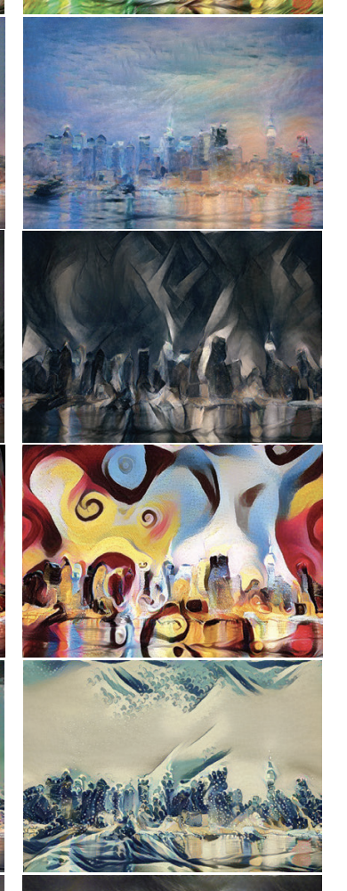

### CNNMRF : Combining Markov Random Fields and Convolutional Neural Networks for Image Synthesis

| data avalibility             | algorithm speed                            | visual quality                           | Portrate / general | complexity of algorithm structrue  | Choice Score                     | Paper URL                            | Year |
| ---------------------------- | ------------------------------------------ | ---------------------------------------- | ------------------ | ---------------------------------- | -------------------------------- | ------------------------------------ | ---- |
| 5 : avalible  0 : unavilible | 5 : quick  0 : slow                        | 5 : good  0 : poor                       |                    | 5 : complex  0 : simple            | 5 : would choose  0 : not choose | https://arxiv.org/pdf/1601.04589.pdf | 2016 |
| No need data                 | 1 (nearest neighbor search on feature map) | 4 for small texture; 0 for large texture | Portrate & General | 4 (due to nearest neighbor search) | 1                                |                                      |      |

Note:

1. local scale (patch) style transfer 
2. Good when have small brush stroke (monet / van goh)
3. Poor when have large painting structure (Japanese painting) - it generally fails when the content and style images have strong differences in perspective and structure since the image patches could not be correctly matched. 

### Controlling Perceptual Factors in Neural Style Transfer

| data avalibility             | algorithm speed     | visual quality     | Portrate / general | complexity of algorithm structrue   | Choice Score                     | Paper URL                            | Year |
| ---------------------------- | ------------------- | ------------------ | ------------------ | ----------------------------------- | -------------------------------- | ------------------------------------ | ---- |
| 5 : avalible  0 : unavilible | 5 : quick  0 : slow | 5 : good  0 : poor |                    | 5 : complex  0 : simple             | 5 : would choose  0 : not choose | https://arxiv.org/pdf/1611.07865.pdf | 2016 |
| No need data                 | 2                   | 3                  | general            | 4 (due to the color, scale control) | 2                                |                                      |      |

Note:

1. **control over spatial location, colour inoformation** is a good idea 
2. dealing stylized sky, backgroudn, target differnetly 
3. **Large size, high quality stylized** 
4. Early stage of work, not good idea 

## MPB-NST

Texture networks 

| data avalibility             | algorithm speed     | visual quality     | Portrate / general | complexity of algorithm structrue | Choice Score                     | Paper URL                                                    | year      |
| ---------------------------- | ------------------- | ------------------ | ------------------ | --------------------------------- | -------------------------------- | ------------------------------------------------------------ | --------- |
| 5 : avalible  0 : unavilible | 5 : quick  0 : slow | 5 : good  0 : poor |                    | 5 : complex  0 : simple           | 5 : would choose  0 : not choose | https://arxiv.org/pdf/1603.03417.pdf   https://arxiv.org/pdf/1701.02096.pdf | 2016 2017 |
| 4                            | 4                   | 2                  | Not good           | 3                                 | 1                                |                                                              |           |

Note:

1. Apply Local texture
   1. Some are good 
   2. some are bad 
2. general look not good 
3. Instance Normalization for texture network 

### Improved Texture Network

| data avalibility             | algorithm speed     | visual quality     | Portrate / general | complexity of algorithm structrue | Choice Score                     | Paper URL                            | year |
| ---------------------------- | ------------------- | ------------------ | ------------------ | --------------------------------- | -------------------------------- | ------------------------------------ | ---- |
| 5 : avalible  0 : unavilible | 5 : quick  0 : slow | 5 : good  0 : poor |                    | 5 : complex  0 : simple           | 5 : would choose  0 : not choose | https://arxiv.org/pdf/1701.02096.pdf | 2017 |
| 4                            | 4                   | 4                  | General            | 4 (no much reference)             | 3                                |                                      |      |

Note:

1. Instance Normalization 
2. Some general image look good 

### Precomputed Real-Time Texture Synthesis with Markovian Generative Adversarial Networks

| data avalibility             | algorithm speed     | visual quality     | Portrate / general | complexity of algorithm structrue | Choice Score                     | Paper URL                            | Year |
| ---------------------------- | ------------------- | ------------------ | ------------------ | --------------------------------- | -------------------------------- | ------------------------------------ | ---- |
| 5 : avalible  0 : unavilible | 5 : quick  0 : slow | 5 : good  0 : poor |                    | 5 : complex  0 : simple           | 5 : would choose  0 : not choose | https://arxiv.org/pdf/1604.04382.pdf | 2016 |
| 4                            | 2                   | 1                  | None               | 2                                 | 1                                |                                      |      |

Note:

1. using GAN for style transfer
   1. result is hard to find tune 
   2. training process unstable 

### Preserving Color in Neural Artistic Style Transfer [Potential]

| data avalibility             | algorithm speed     | visual quality               | Portrate / general | complexity of algorithm structrue | Choice Score                     | Paper URL                            | Year |
| ---------------------------- | ------------------- | ---------------------------- | ------------------ | --------------------------------- | -------------------------------- | ------------------------------------ | ---- |
| 5 : avalible  0 : unavilible | 5 : quick  0 : slow | 5 : good  0 : poor           |                    | 5 : complex  0 : simple           | 5 : would choose  0 : not choose | https://arxiv.org/pdf/1606.05897.pdf | 2016 |
| 1                            | 4                   | only few demo image avalible | portrate           | 3                                 | 3                                |                                      |      |

Note:

1. **idea of preserve color is important** : preseve original photo color 
2. general result don't have much change 
3. Decent choice when only applied to portrate photo 

(demo photo from app)

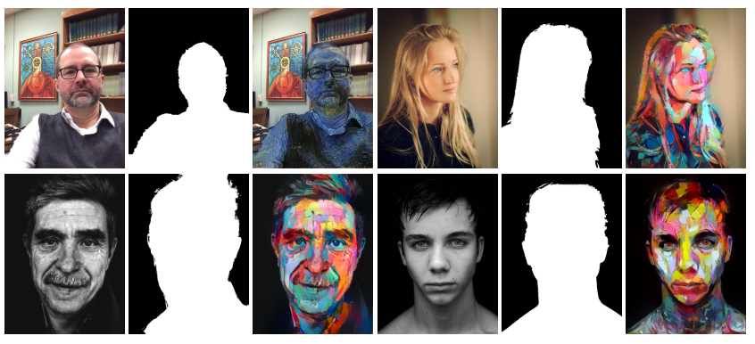

### GLStyleNet: Higher Quality Style Transfer Combining Global and Local Pyramid Features

| data avalibility             | algorithm speed     | visual quality     | Portrate / general | complexity of algorithm structrue | Choice Score                     | Paper URL                            | Year |
| ---------------------------- | ------------------- | ------------------ | ------------------ | --------------------------------- | -------------------------------- | ------------------------------------ | ---- |
| 5 : avalible  0 : unavilible | 5 : quick  0 : slow | 5 : good  0 : poor |                    | 5 : complex  0 : simple           | 5 : would choose  0 : not choose | https://arxiv.org/pdf/1811.07260.pdf | 2018 |
| 4                            | 4                   |                    | Portrate           | 4                                 | 4                                |                                      |      |

Note:

1. **feature pyramid fusion neural network**

2. algorithm may be over complicated to implement 

3. **Consider global features and local features sepratebly**

   1. need the photo and painting to match 

   

### AdaIN Arbitrary Style Transfer in Real-time with Adaptive Instance Normalization

| data avalibility             | algorithm speed     | visual quality     | Portrate / general | complexity of algorithm structrue | Choice Score                     | Paper URL                              | Year |
| ---------------------------- | ------------------- | ------------------ | ------------------ | --------------------------------- | -------------------------------- | -------------------------------------- | ---- |
| 5 : avalible  0 : unavilible | 5 : quick  0 : slow | 5 : good  0 : poor |                    | 5 : complex  0 : simple           | 5 : would choose  0 : not choose | https://arxiv.org/pdf/1703.06868v2.pdf | 2017 |
| 4                            | 4                   | 1                  |                    |                                   | 1                                |                                        |      |

Note:

1. some visual quality are not that good 
2. can choose to transform style not color 

### Visual Attribute Transfer through Deep Image Analogy [Potential]

| data avalibility             | algorithm speed     | visual quality            | Portrate / general     | complexity of algorithm structrue                            | Choice Score                     | Paper URL                            | Year |
| ---------------------------- | ------------------- | ------------------------- | ---------------------- | ------------------------------------------------------------ | -------------------------------- | ------------------------------------ | ---- |
| 5 : avalible  0 : unavilible | 5 : quick  0 : slow | 5 : good  0 : poor        |                        | 5 : complex  0 : simple                                      | 5 : would choose  0 : not choose | https://arxiv.org/pdf/1705.01088.pdf | 2017 |
| 4                            | 2                   | 4 (when constrain is met) | Portrate / fixed scene | 5 (no much reference， only torch, algorithm is complicated) | 3                                |                                      |      |

Note:

1. May only used in constrained scene 
   1. Portrate Mode 
   2. Scene transfer (national park summer time -> national park winter time)
2. Run time requires nearest neighbor search 
3. coarse to fine 
4. **Visual Attribute Transger for semantic similar image**
5. **constrain on input output is too much**
6. **tackle the style transfer through other approach**
7. may also use for scene transfger 

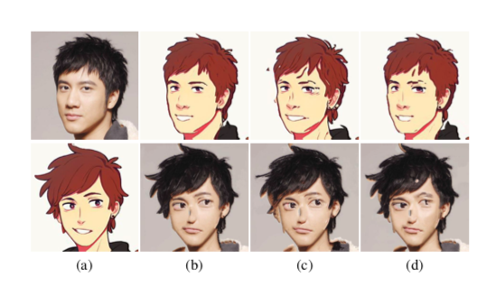

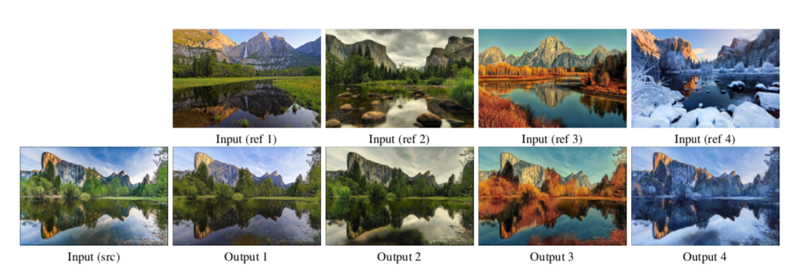

### Fast Patch-based Style Transfer of Arbitrary Style 

| data avalibility             | algorithm speed     | visual quality                  | Portrate / general | complexity of algorithm structrue      | Choice Score                     | Paper URL                            | Year |
| ---------------------------- | ------------------- | ------------------------------- | ------------------ | -------------------------------------- | -------------------------------- | ------------------------------------ | ---- |
| 5 : avalible  0 : unavilible | 5 : quick  0 : slow | 5 : good  0 : poor              |                    | 5 : complex  0 : simple                | 5 : would choose  0 : not choose | https://arxiv.org/pdf/1612.04337.pdf | 2016 |
| 2                            | 1                   | some style good, some style bad | general            | 4 (have limited reference, Torch only) | 2                                |                                      |      |

Note:

1. **patch idea is important**
2. some style good, some style bad 
3. Not really stylized 

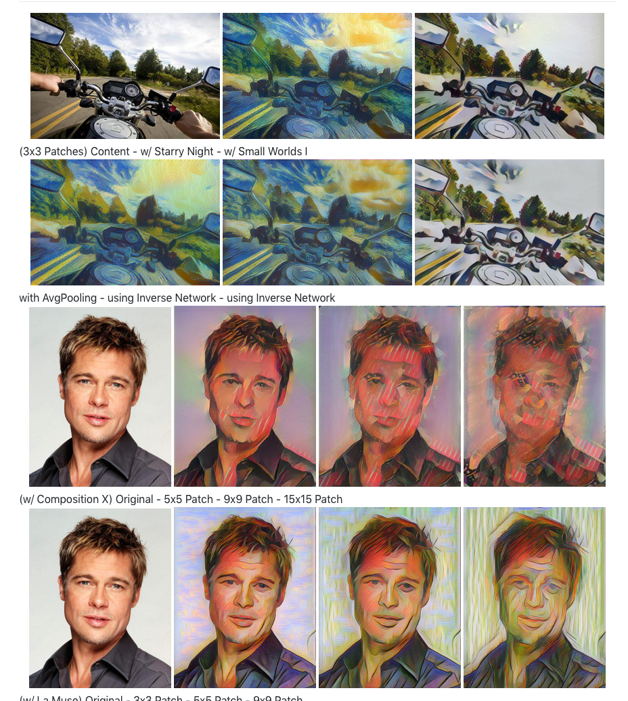

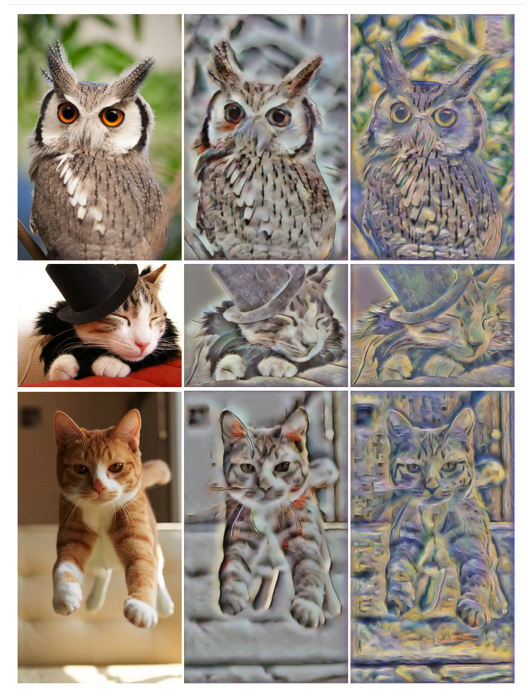

### WCT Universal Style Transfer via Feature Transforms

| data avalibility             | algorithm speed     | visual quality     | Portrate / general | complexity of algorithm structrue | Choice Score                     | Paper URL                                                    | Year |
| ---------------------------- | ------------------- | ------------------ | ------------------ | --------------------------------- | -------------------------------- | ------------------------------------------------------------ | ---- |
| 5 : avalible  0 : unavilible | 5 : quick  0 : slow | 5 : good  0 : poor |                    | 5 : complex  0 : simple           | 5 : would choose  0 : not choose | http://papers.nips.cc/paper/6642-universal-style-transfer-via-feature-transforms.pdf | 2017 |
| 4                            | 4                   | 3                  |                    | 3                                 | 2                                |                                                              |      |

Note:

1. commonly cited 
2. Whitering and coloring transformations 
3. "stylize" different part of the art work 
4. generated result tend to be blurry

### MST : Multimodal Style Transfer via Graph Cuts [POTENTIAL]

| data avalibility             | algorithm speed     | visual quality     | Portrate / general | complexity of algorithm structrue | Choice Score                     | Paper URL                              | Year |
| ---------------------------- | ------------------- | ------------------ | ------------------ | --------------------------------- | -------------------------------- | -------------------------------------- | ---- |
| 5 : avalible  0 : unavilible | 5 : quick  0 : slow | 5 : good  0 : poor |                    | 5 : complex  0 : simple           | 5 : would choose  0 : not choose | https://arxiv.org/pdf/1904.04443v6.pdf | 2019 |
| 4                            | 4                   | 4                  | general & Portrate | 3                                 | 4                                |                                        |      |

Notice:

1. Improvement on WCT
2. **sider gloabl effect & local effect differently** 
3. showed style more on abstract art & heavy brush stroke 
4. **not a feed forward network** 
5. Input style when the model is called, can be used as customized style model 

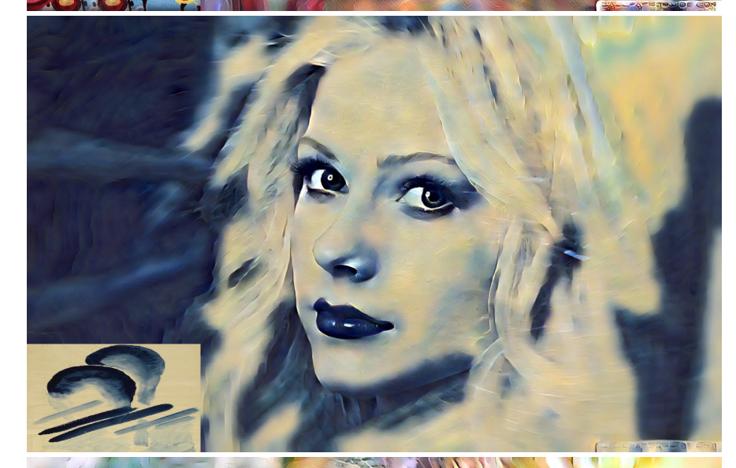

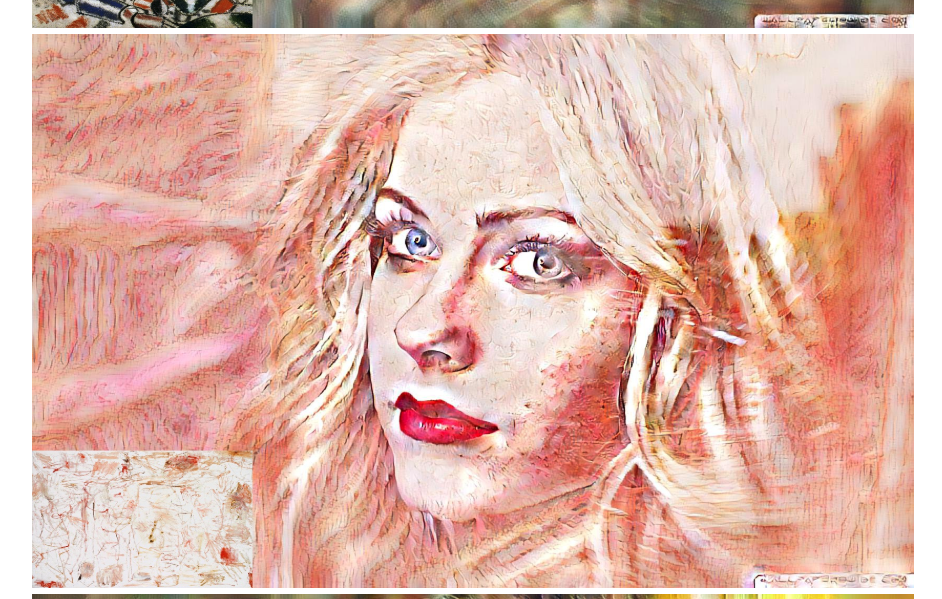

### A Style-Aware Content Loss for Real-time HD Style Transfer [POTENTIAL]

> Dmytro Kotovenko

| data avalibility             | algorithm speed     | visual quality     | Portrate / general | complexity of algorithm structrue | Choice Score                     | Paper URL                            | Year |
| ---------------------------- | ------------------- | ------------------ | ------------------ | --------------------------------- | -------------------------------- | ------------------------------------ | ---- |
| 5 : avalible  0 : unavilible | 5 : quick  0 : slow | 5 : good  0 : poor |                    | 5 : complex  0 : simple           | 5 : would choose  0 : not choose | https://arxiv.org/pdf/1807.10201.pdf | 2018 |
| 4                            | 4                   | 4                  | General            | 3                                 | 4                                |                                      |      |

Note:

1. **high resolution**
2. real time 
3. **merge many style and form "artist"** 
4. no much blurry effect & blob effect 

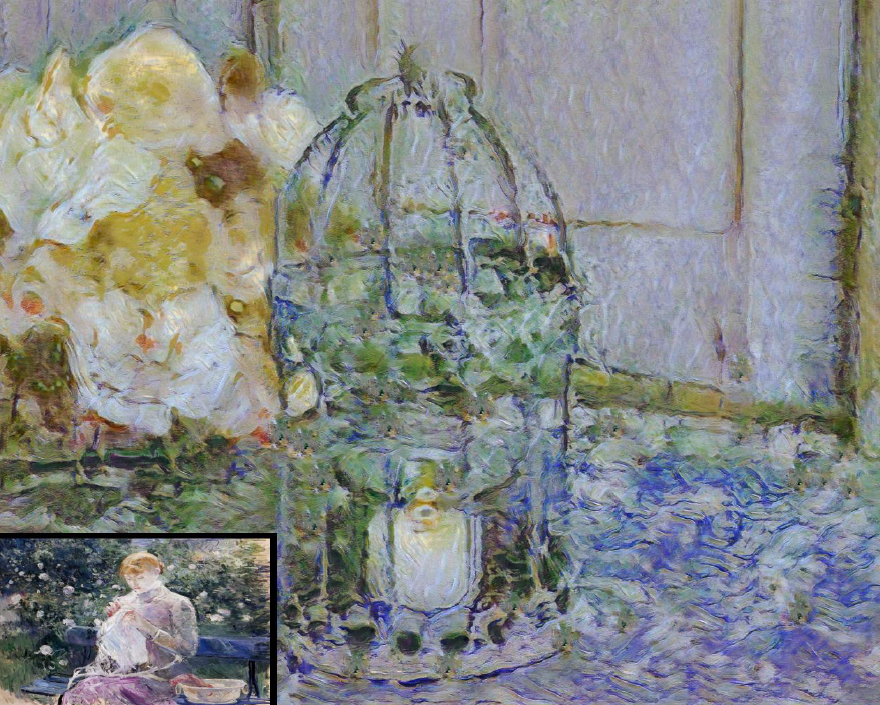

### **A Content Transformation Block for Image Style Transfer**

> Dmytro Kotovenko

| data avalibility             | algorithm speed     | visual quality     | Portrate / general | complexity of algorithm structrue                         | Choice Score                     | Paper URL                                                    | Year |
| ---------------------------- | ------------------- | ------------------ | ------------------ | --------------------------------------------------------- | -------------------------------- | ------------------------------------------------------------ | ---- |
| 5 : avalible  0 : unavilible | 5 : quick  0 : slow | 5 : good  0 : poor |                    | 5 : complex  0 : simple                                   | 5 : would choose  0 : not choose | http://openaccess.thecvf.com/content_CVPR_2019/papers/Kotovenko_A_Content_Transformation_Block_for_Image_Style_Transfer_CVPR_2019_paper.pdf | 2019 |
| 0                            | 4                   | 4                  | General            | 5 (architecture is complex & no official code supplement) | 3                                |                                                              |      |

Note:

1. Content Transformation Module : not only transfer style, but also emphasis content shape 
2. style transfer based on underlying object 
3. rouphly = A Style-Aware Content Loss for Real-time HD Style Transfer + Content transformation module

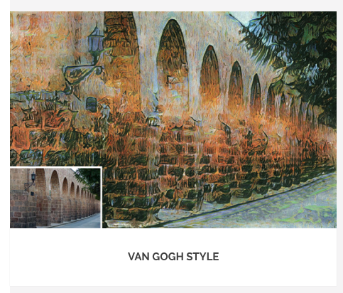

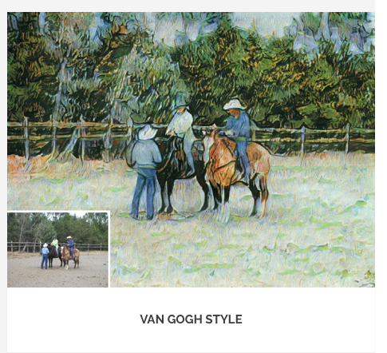

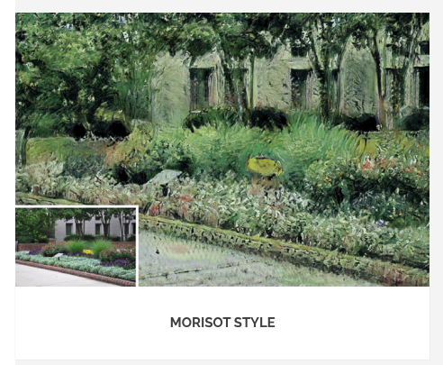

### Content and Style Disentanglement for Artistic Style Transfer

> Dmytro Kotovenko

| data avalibility             | algorithm speed     | visual quality     | Portrate / general | complexity of algorithm structrue       | Choice Score                     | Paper URL                                                    | Year |
| ---------------------------- | ------------------- | ------------------ | ------------------ | --------------------------------------- | -------------------------------- | ------------------------------------------------------------ | ---- |
| 5 : avalible  0 : unavilible | 5 : quick  0 : slow | 5 : good  0 : poor |                    | 5 : complex  0 : simple                 | 5 : would choose  0 : not choose | http://openaccess.thecvf.com/content_ICCV_2019/papers/Kotovenko_Content_and_Style_Disentanglement_for_Artistic_Style_Transfer_ICCV_2019_paper.pdf | 2019 |
| 0                            | 4                   | 4                  | General            | 5 (no much reference, no official code) | 3                                |                                                              |      |

Note:

1. visual quality is good 
2. variationa and change in several style 
3. **local texture is well preserved** 
4. rouphly = A Style-Aware Content Loss for Real-time HD Style Transfer + variation of style 
   1. most model only learn visual clues most dominate in the style and ignore the rest of the style 

### Attention-aware Multi-stroke Style Transfer

| data avalibility             | algorithm speed     | visual quality     | Portrate / general | complexity of algorithm structrue | Choice Score                     | Paper URL                              | Year |
| ---------------------------- | ------------------- | ------------------ | ------------------ | --------------------------------- | -------------------------------- | -------------------------------------- | ---- |
| 5 : avalible  0 : unavilible | 5 : quick  0 : slow | 5 : good  0 : poor |                    | 5 : complex  0 : simple           | 5 : would choose  0 : not choose | https://arxiv.org/pdf/1901.05127v1.pdf | 2019 |
| 2                            |                     | 4                  |                    | 5                                 | 3                                |                                        |      |

Note:

1. use the **attention idea** to guide style transfer 
2. the model architecture is way too complicated. 

